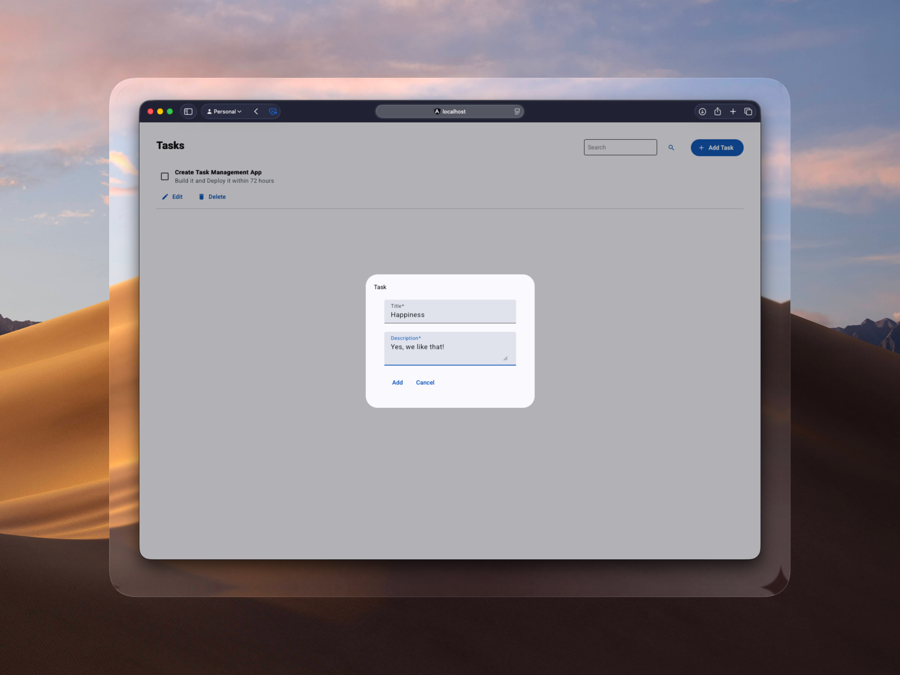

# Tasky - Task Management App
Full Stack Task Management App.



### Installation

1. Clone the repository:
   ```bash
   git clone https://github.com/Johnyoat/tasky-demo.git
   cd tasky-demo
   ```

2. Start the application:
   ```bash
   docker-compose up 
   ```

## Usage

Once the containers are healthy, the application will be available at:

- **Frontend**: [http://localhost](http://localhost)
- **API Health Check**: [http://localhost:3000](http://localhost:3000)
- **API (v1)**: [http://localhost:3000/api/v1/tasks](http://localhost:3000/api/v1/tasks)

### API Endpoints

| Method | Endpoint | Description |
|--------|----------|-------------|
| `GET` | `/api/v1/tasks` | Fetch all tasks |
| `POST` | `/api/v1/tasks` | Create a new task |
| `PUT` | `/api/v1/tasks/:id` | Update a task by ID |
| `DELETE` | `/api/v1/tasks/:id` | Delete a task by ID |

